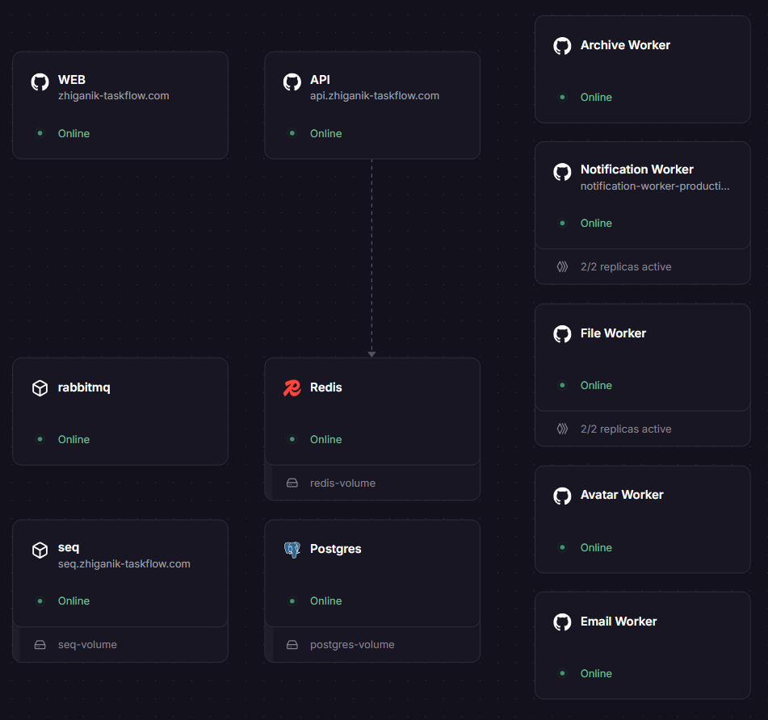

# TaskFlow

> Full-stack task & project management — Kanban board, real-time notifications, file attachments, and workspace RBAC. Built as a portfolio project; every architectural decision is justifiable to a senior engineer.

[](https://dotnet.microsoft.com/)
[](https://react.dev/)
[](https://www.postgresql.org/)
[](https://redis.io/)
[](https://www.rabbitmq.com/)
[](https://docs.docker.com/compose/)
[](https://railway.app/)

**[Live Demo →](https://zhiganik-taskflow.com/)** &nbsp;·&nbsp; **[Swagger API →](https://api.zhiganik-taskflow.com/swagger/)**

---

## Table of Contents

- [Live Demo](#live-demo)
- [Features](#features)
- [Tech Stack](#tech-stack)
- [Architecture](#architecture)
- [Deep Dive: Real-time Notifications](#deep-dive-real-time-notifications-signalr--rabbitmq)
- [Deep Dive: Email Invitations](#deep-dive-email-invitations-resend--rabbitmq)
- [Deep Dive: File Attachment Pipeline](#deep-dive-file-attachment-pipeline)
- [Two-Level Cache](#two-level-cache)
- [Authentication & RBAC](#authentication--rbac)
- [Deployment](#deployment-railway--cloudflare)
- [Getting Started](#getting-started-local)

---

## Live Demo

| URL | Description |
|-----|-------------|
| [zhiganik-taskflow.com](https://zhiganik-taskflow.com/) | Full application |
| [api.zhiganik-taskflow.com/swagger](https://api.zhiganik-taskflow.com/swagger/) | Interactive API docs (Swagger UI) |
| [seq.zhiganik-taskflow.com](https://seq.zhiganik-taskflow.com) | Centralized structured logs (Seq) |

> Register a free account to explore all features, or use the Swagger UI to call the API directly.

---

## Features

### Workspaces & Access Control
- Multi-tenant workspaces — each user can own or belong to multiple workspaces
- Per-workspace roles: **Owner / Admin / Member** — enforced on every request via DB lookup (not encoded in JWT, so revocation is immediate)
- Workspace invitations sent by email; invite links are time-limited tokens

### Kanban Board
- Configurable columns (create, rename, reorder, delete)
- Cursor-based pagination for tasks — stable ordering even under concurrent writes
- Filters: status, priority, assignee, label, due date
- Per-workspace priority colors & display names (fully customizable)
- Workspace-scoped colored labels with many-to-many task assignment

### Task Detail
- Rich text comments with Markdown + `@mention` support (renders as clickable badges)
- File attachments: upload → async processing → download (see [attachment pipeline](#deep-dive-file-attachment-pipeline))
- Due dates, assignees, priority, status transitions
- Archive / bulk-archive with background worker

### Real-time Notifications
- 4 event types: **MentionedInComment**, **TaskAssigned**, **TaskStatusChanged**, **MemberInvited**
- Delivered instantly via **SignalR** backed by a RabbitMQ event bus (see [deep dive](#deep-dive-real-time-notifications-signalr--rabbitmq))
- Bell icon with unread count, notification panel with cursor-paginated history
- Mark individual or all notifications as read

### Profile & Avatars
- Upload + crop avatar; processed by a dedicated **AvatarWorker**
- Profile page shows assigned tasks across all workspaces

### Performance & Observability
- **Two-level hybrid cache** (in-memory L1 + Redis L2) for workspace/member/column reads
- Cache hit/miss stats per category at `GET /api/v1/admin/cache-stats`
- Structured JSON logging via **Serilog**, forwarded to **Seq**

---

## Tech Stack

| Layer | Technologies |
|-------|-------------|
| **API** | ASP.NET Core 9, C#, EF Core 9, FluentValidation, AutoMapper 16, Serilog, JWT Bearer |
| **Messaging** | RabbitMQ 3, MassTransit (publish/subscribe, consumers, retry policies) |
| **Real-time** | ASP.NET Core SignalR, Redis backplane (multi-replica safe) |
| **Email** | FluentEmail + **Resend API** (production), Mailpit (local SMTP capture) |
| **Database** | PostgreSQL 16, ASP.NET Identity, EF Core Fluent API, cursor pagination |
| **Cache** | Redis 7 (L2 cache + SignalR backplane + presence tracking), IMemoryCache (L1) |
| **Frontend** | React 19, Vite 6, TypeScript (strict), React Router v7, Tailwind CSS v4 |
| **State** | TanStack Query v5 (server state), Zustand v5 (auth, localStorage persist) |
| **Forms** | React Hook Form v7 + Zod v4 (mirrors backend FluentValidation rules) |
| **HTTP** | Axios with JWT interceptor, auto-refresh on 401, `@microsoft/signalr` v10 |
| **Testing** | NUnit 4, Moq, FluentAssertions (unit tests, mocked — no live dependencies) |
| **Infra** | Docker Compose, Nginx (SPA + `/api` reverse proxy), Railway, Cloudflare DNS/SSL |

---

## Architecture

The system runs as **11 services** in production on Railway, coordinated through RabbitMQ and Redis:

```
                    ┌─────────────────────────────────────┐
                    │            Cloudflare DNS/SSL        │
                    └────────────┬────────────────────────┘
                                 │
              ┌──────────────────┼──────────────────┐
              ▼                  ▼                  ▼
     zhiganik-taskflow.com  api.zhiganik-...   seq.zhiganik-...
              │                  │
              ▼                  ▼
    ┌──────────────┐    ┌──────────────────┐
    │  WEB service │    │   API service    │
    │  React SPA   │    │ ASP.NET Core 9   │
    │  Nginx proxy │    │   Controllers    │
    └──────┬───────┘    └───┬──────────────┘
           │ /api/*         │
           └───────────────▶│
                            │── EF Core ──▶ PostgreSQL
                            │── Redis ────▶ L2 Cache + Presence
                            │
                            │ MassTransit (publish)
                            ▼
                   ┌─────────────────┐
                   │    RabbitMQ     │
                   └──┬──────────────┘
                      │
          ┌───────────┼──────────────┬──────────────┐
          ▼           ▼              ▼              ▼
  ┌───────────────┐  ┌────────────┐  ┌───────────┐  ┌──────────────┐
  │ Notification  │  │   Email    │  │  Avatar   │  │   Archive    │
  │ Worker (×2)   │  │  Worker    │  │  Worker   │  │   Worker     │
  │               │  │            │  │           │  │              │
  │ Consumes event│  │ Resend API │  │ Processes │  │ Bulk-archive │
  │ Writes to DB  │  │ sends email│  │  images   │  │  old tasks   │
  │ SignalR push  │  └────────────┘  └───────────┘  └──────────────┘
  └───────┬───────┘
          │ SignalR (Redis backplane)
          ▼
  All connected browser sessions

  File upload (in-process):
  POST /attachments ──▶ IBlobService (disk/Azure) ──▶ Channel<Guid>
                         ▲                                  │
                         │                                  ▼
                    FileProcessingService ◀── background dequeue
                    Pending → Processing → Ready
```

### Solution Structure

```
TaskFlow.Api/                  HTTP controllers, middleware, background services
TaskFlow.Application/          Interfaces, services, DTOs, validators
TaskFlow.Infrastructure/       EF Core, repositories, Redis, blob storage
TaskFlow.Contracts/            Shared MassTransit message types
TaskFlow.Tests/                NUnit 4 unit tests (mocked, no Docker needed)
TaskFlow.NotificationWorker/   SignalR hub + RabbitMQ consumer (2 replicas)
TaskFlow.EmailWorker/          Resend API consumer
TaskFlow.AvatarWorker/         Avatar image processing consumer
TaskFlow.ArchiveWorker/        Task auto-archiving consumer
taskflow-web/                  React 19 + Vite frontend
```

Dependency rule: `Api → Application ← Infrastructure`. Infrastructure never references Api.

---

## Deep Dive: Real-time Notifications (SignalR + RabbitMQ)

Notifications are fully event-driven — the API never calls SignalR directly.

```
User action in browser
        │
        ▼
  API Service
  (e.g. TaskCommentsService.CreateAsync)
        │
        │ publishes CommentPostedEvent via MassTransit
        ▼
    RabbitMQ
        │
        │ consumed by NotificationWorker (2 replicas)
        ▼
  NotificationWorker
  1. Writes Notification row to PostgreSQL
  2. Calls SignalR hub: ReceiveNotification(NotificationDto)
        │
        │ Redis backplane routes to correct replica
        ▼
  Browser (any tab, any server replica)
  useNotificationHub hook fires
  → React Query invalidates /notifications/unread-count
  → Bell badge updates instantly
```

**Event types:**

| Event | Trigger |
|-------|---------|
| `MentionedInComment` | User is `@mentioned` in a task comment |
| `TaskAssigned` | Task assigned to a user |
| `TaskStatusChanged` | Task status changes (not by the assignee themselves) |
| `MemberInvited` | User added to a workspace |

**Implementation notes:**
- SignalR hub authenticates via JWT passed as `?access_token=` query parameter — browsers cannot set the `Authorization` header on WebSocket upgrade requests
- Redis backplane (`AddSignalR().AddStackExchangeRedis(...)`) means both NotificationWorker replicas can push to any connected client regardless of which replica they hit
- Presence tracking: a Redis SET (`presence:online-users`) records connected user IDs for future mobile push notification support
- On page load, unread count is fetched via REST (`GET /api/v1/notifications/unread-count`) as a fallback for any missed pushes while the tab was closed

---

## Deep Dive: Email Invitations (Resend + RabbitMQ)

Workspace invitations are sent asynchronously — the API responds immediately and email delivery is decoupled.

```
Admin: POST /api/v1/workspaces/{id}/invitations
        │
        │ publishes SendInvitationEmailMessage to RabbitMQ
        ▼ 202 Accepted (returns invitation record immediately)

    RabbitMQ
        │
        │ consumed by EmailWorker
        ▼
  EmailWorker
  FluentEmail + Resend API
        │
        ▼
  Recipient inbox — email contains invite link
  (link carries a time-limited token → POST /api/v1/invitations/accept)
```

**Message contract:**
```csharp
record SendInvitationEmailMessage(
    string ToEmail,
    string WorkspaceName,
    string Role,
    string InviteLink);
```

**Local development:** Mailpit container captures all outgoing SMTP — no real emails sent.
Web UI at `http://localhost:8025` shows rendered HTML, headers, and raw source.

**Production:** Resend API (configured via `RESEND_API_KEY` + `EMAIL_FROM` Railway variables).

---

## Deep Dive: File Attachment Pipeline

File uploads are non-blocking — the client gets an immediate response while processing happens in the background.

```
1. POST /api/v1/workspaces/{wsId}/tasks/{taskId}/attachments
        │
        │ validates extension (blocks .exe, .bat, .ps1, .sh, .dll, etc.)
        │ saves file: IBlobService → /app/uploads/{uuid}{ext}   ← server-generated name, never user input
        │ writes TaskAttachment row (status: Pending)
        │ enqueues attachment ID to IFileProcessingQueue (Channel<Guid>)
        ▼ 202 Accepted — AttachmentDto with status: Pending

2. FileProcessingService (background, same process as API)
        │ dequeues ID
        │ status → Processing
        │ validates file (mime check, size check)
        │ status → Ready  (or → Failed with ProcessingError logged)

3. Frontend (React Query)
        │ polls GET .../attachments every 2 s while status is Pending or Processing
        │ stops automatically when Ready or Failed

4. GET .../attachments/{id}/download
        │ only available when status = Ready
        ▼ FileStreamResult with range processing (supports partial content / resume)

5. Startup recovery
        │ FileProcessingService queries IX_TaskAttachments_Status index on boot
        ▼ re-queues any attachments stuck in Pending or Processing
```

**Abstraction:** `IBlobService` wraps local disk storage. Swapping to Azure Blob Storage requires only a new implementation — no service or controller changes.

**`IFileProcessingQueue`** wraps `Channel<Guid>`. Swapping to Azure Service Bus requires only a new implementation.

---

## Two-Level Cache

Reads for hot data (workspaces, members, columns) go through a two-level cache before hitting PostgreSQL.

```
Request
  │
  ▼ check L1 (IMemoryCache, 30 s TTL, per-replica)
  │  hit → return
  │  miss ↓
  ▼ check L2 (Redis, 5–10 min TTL, shared across replicas)
  │  hit → populate L1 → return
  │  miss ↓
  ▼ PostgreSQL query
     → populate L2 → populate L1 → return
```

| Cache key | L2 TTL | Invalidated on |
|-----------|--------|----------------|
| `user:{userId}:workspaces` | 5 min | Create / update / delete workspace or membership |
| `workspace:{wsId}:members` | 10 min | Add / remove / update member |
| `workspace:{wsId}:columns` | 10 min | Create / rename / reorder / delete column |

Cache hit/miss counters are stored in Redis (`stats:cache:hits:{category}`) and exposed at `GET /api/v1/admin/cache-stats`.

---

## Authentication & RBAC

**Auth flow:**

```
POST /auth/register  →  ASP.NET Identity creates AppUser (PBKDF2 password hash)
POST /auth/login     →  validates credentials → issues JWT (60 min) + refresh token
                         JWT payload: sub (userId), email, displayName
All requests          →  Axios attaches Authorization: Bearer {token}
On 401               →  Axios interceptor calls POST /auth/refresh
                         issues new access token + new single-use refresh token (rotates)
```

**Workspace RBAC:**

Roles are **not embedded in the JWT**. On every request that hits a `[Authorize(Policy = WorkspacePolicies.Member/Admin/Owner)]` endpoint, `WorkspaceRoleHandler` resolves the caller's role from the DB using the `{workspaceId}` route parameter and a composite index on `WorkspaceMembers(WorkspaceId, UserId)`. This means revoking a member takes effect on the next request — no token re-issue required.

Role hierarchy: `Owner (0) > Admin (1) > Member (2)` — access granted when `userRole <= requiredRole`.

---

## Deployment (Railway + Cloudflare)

All services run on **Railway** (11 services, same private network):



| Railway Service | Replicas | Public Domain |
|----------------|----------|---------------|
| WEB | 1 | zhiganik-taskflow.com |
| API | 1 | api.zhiganik-taskflow.com |
| Notification Worker | **2** | — |
| File Worker | **2** | — |
| Email Worker | 1 | — |
| Avatar Worker | 1 | — |
| Archive Worker | 1 | — |
| PostgreSQL | 1 | — (postgres-volume) |
| Redis | 1 | — (redis-volume) |
| RabbitMQ | 1 | — |
| Seq | 1 | seq.zhiganik-taskflow.com |

Workers with 2 replicas (Notification, File) are safe due to Redis backplane (SignalR) and idempotent message consumers (MassTransit).

**Cloudflare** sits in front of Railway for all public domains:
- DNS routing (`CNAME` → Railway-assigned hostnames)
- TLS termination (Cloudflare-managed certificates)
- CDN caching for hashed static assets (Vite content-hash filenames → 1-year `Cache-Control`)

**Secrets** are Railway project variables (`JWT_SECRET`, `RESEND_API_KEY`, `POSTGRES_PASSWORD`, `REDIS_PASSWORD`, `RABBITMQ_USER`, `RABBITMQ_PASSWORD`, `EMAIL_FROM`, `FRONTEND_BASE_URL`, etc.) — never committed to source.

---

## Getting Started (Local)

### Prerequisites

- [Docker](https://docs.docker.com/get-docker/) + Docker Compose
- `.NET 9 SDK` — only needed to run tests on the host
- `Node 20+` — only needed for frontend hot-reload dev server

### Run the full stack

```bash
git clone https://github.com/zh1ganik/TaskFlow.git
cd TaskFlow

# Copy environment template and fill in secrets
cp .env.example .env
# Required: POSTGRES_PASSWORD, REDIS_PASSWORD, RABBITMQ_USER, RABBITMQ_PASSWORD, JWT_SECRET
# For email: RESEND_API_KEY, EMAIL_FROM, EMAIL_FROM_NAME
# Leave RESEND_API_KEY empty to use Mailpit (local email capture)

# Build and start all services
make up

# Apply database migrations
make migrate

# Open the app
open http://localhost:3000
```

### Useful commands

```bash
make down         # stop all containers (volumes preserved)
make reset        # wipe all data and restart fresh
make logs         # tail logs from all services
make api-logs     # tail API service logs only
make test         # run NUnit unit tests on host (no Docker needed)
make shell        # bash into the API container
make db-shell     # psql into the PostgreSQL container
```

### Local-only service UIs

| UI | URL | Purpose |
|----|-----|---------|
| App | http://localhost:3000 | React frontend |
| Swagger | http://localhost:5000/swagger | API documentation |
| Mailpit | http://localhost:8025 | Captured outgoing emails |
| RabbitMQ | http://localhost:15672 | Queue management (guest/guest) |

### Frontend hot-reload (optional)

```bash
make web-install                    # npm install (first time only)
cd taskflow-web && npm run dev      # starts Vite dev server on :5173
                                    # proxies /api/* → localhost:5000
```

---

## Project Structure (quick reference)

```
TaskFlow.Api/            Controllers, middleware, DI wiring, Program.cs
TaskFlow.Application/    Services, DTOs, validators, interfaces (no EF)
TaskFlow.Infrastructure/ EF Core DbContext, repositories, Redis, IBlobService
TaskFlow.Contracts/      MassTransit message types (shared across workers)
TaskFlow.Tests/          NUnit 4 unit tests — mocked, run on host
TaskFlow.NotificationWorker/  SignalR hub + notification consumer
TaskFlow.EmailWorker/    Resend email consumer
TaskFlow.AvatarWorker/   Avatar processing consumer
TaskFlow.ArchiveWorker/  Task auto-archive consumer
taskflow-web/            React 19 + Vite + TypeScript frontend
  src/api/               All HTTP calls (never fetch/axios in components)
  src/hooks/             React Query hooks
  src/components/        UI components (no API calls)
  src/pages/             Route-level components
  src/store/             Zustand auth store (localStorage persist)
  src/types/             TypeScript interfaces mirroring backend DTOs
```
